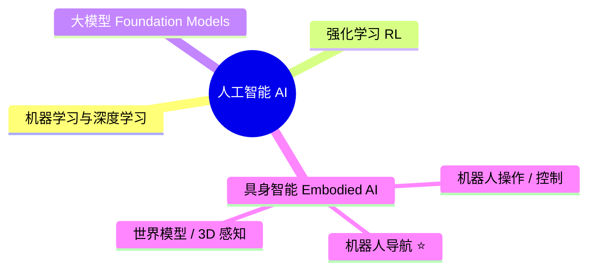
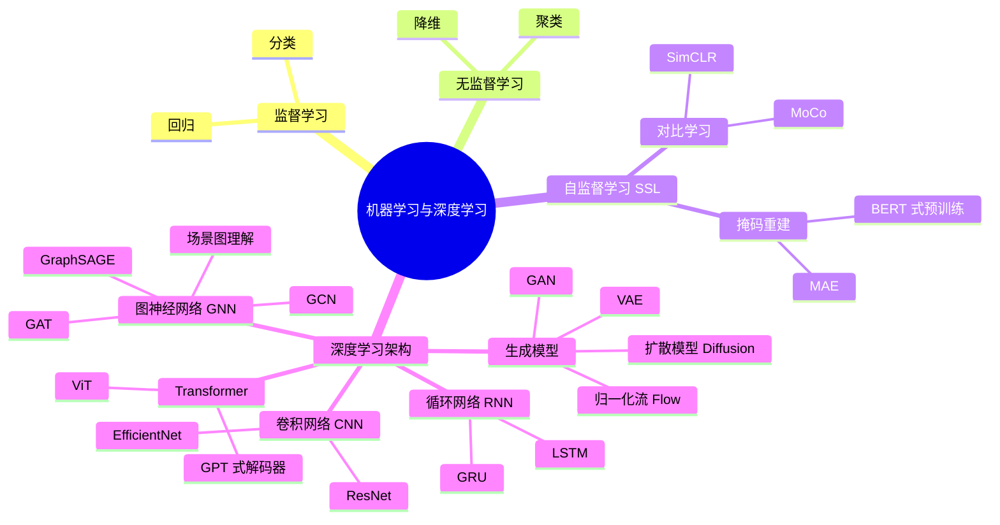
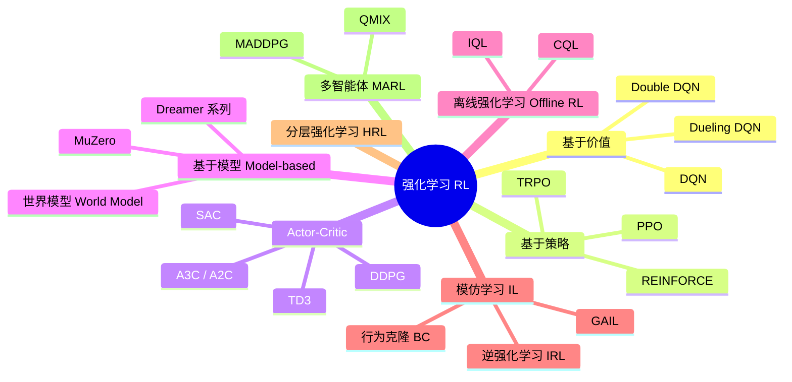
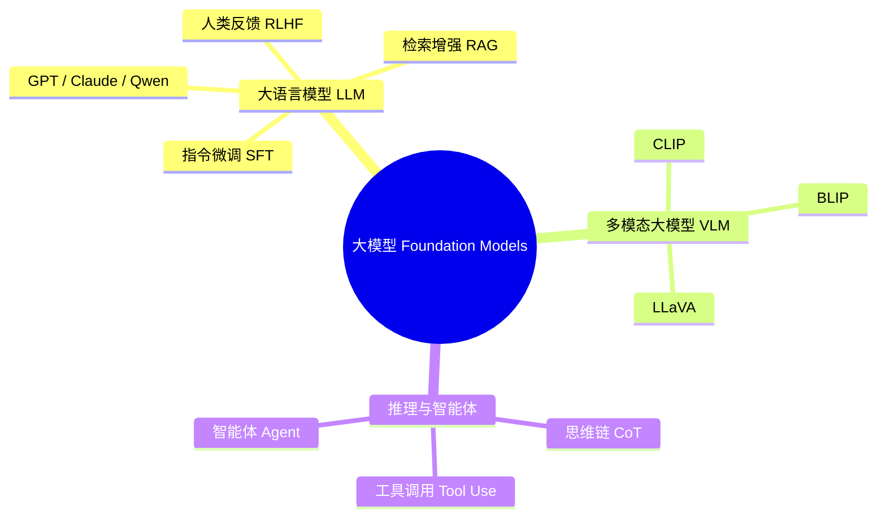
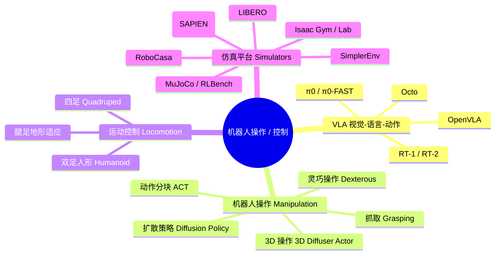
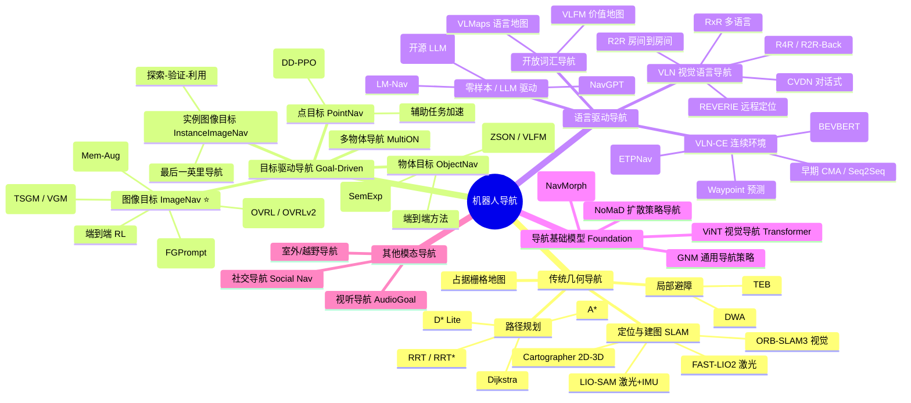
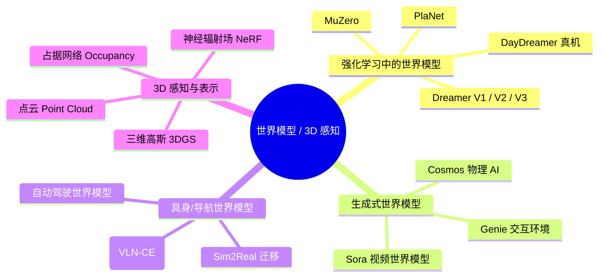

[English](README.md) | **简体中文**

# 👋 你好,我是 GaryLee1210

> 🎓 东北大学(中国)机器人科学与工程在读硕士(研一) | 💼 目前在 **Beta 无限** 实习 | 🧭 **Image-Goal Navigation / 端到端机器人导航**
> 投递过 RA-L,主攻图像目标导航 (Image-Goal Navigation),
> 后续兴趣方向:Vision-and-Language Navigation (VLN)、基于世界模型的导航、具身导航任务的 Sim-to-Real。

本仓库是我个人对 **AI - 具身智能 - 机器人导航** 整体技术体系的梳理。
图为知识结构,表为代表算法与官方代码仓库,持续更新中。

---

## 🚁 精选项目

| 项目 | 简介 |
|---|---|
| [**UAV-Navigation-System**](https://github.com/GaryLee1210/UAV-Navigation-System) | 自研 250mm 自主导航四旋翼:Livox Mid-360 + **FAST-LIO2 / DLIO** 激光-惯性定位 + **EGO-Planner** 航点导航,已实机验证(Jetson Orin NX + PX4)。路线图:自主探索 → 基于 DRL 的端到端导航。 |

---

## 🗺️ 总览 (Big Picture)

⭐ = 我目前的研究重点。

---

## 📊 一、机器学习与深度学习

**代表算法 / 库**

| 名称 | 类别 | 代码 | 一句话说明 |
|---|---|---|---|
| PyTorch | 框架 | [pytorch/pytorch](https://github.com/pytorch/pytorch) | 主流深度学习框架 |
| timm | 视觉骨干 | [huggingface/pytorch-image-models](https://github.com/huggingface/pytorch-image-models) | 几乎所有视觉 backbone 的开源实现 |
| MAE | 自监督 | [facebookresearch/mae](https://github.com/facebookresearch/mae) | 掩码自编码器,视觉自监督代表作 |
| CLIP | 多模态 | [openai/CLIP](https://github.com/openai/CLIP) | 图像-文本对比学习,具身智能里几乎人手一个 |
| DINOv2 | 自监督 | [facebookresearch/dinov2](https://github.com/facebookresearch/dinov2) | 强自监督视觉表征,被很多 VLA / 导航工作采用 |

---

## 🎮 二、强化学习 (RL)

**代表算法 / 库**

| 名称 | 类别 | 代码 | 一句话说明 |
|---|---|---|---|
| Stable-Baselines3 | RL 算法库 | [DLR-RM/stable-baselines3](https://github.com/DLR-RM/stable-baselines3) | PyTorch 实现的可靠 RL 算法集合 (PPO / SAC / DQN 等) |
| RL Baselines3 Zoo | 训练脚本 | [DLR-RM/rl-baselines3-zoo](https://github.com/DLR-RM/rl-baselines3-zoo) | SB3 配套的训练 / 调参 / 评估框架 |
| CleanRL | 单文件 RL | [vwxyzjn/cleanrl](https://github.com/vwxyzjn/cleanrl) | 每个算法一个文件,适合阅读和魔改 |
| DreamerV3 | 世界模型 RL | [danijar/dreamerv3](https://github.com/danijar/dreamerv3) | Nature 2025,在 150+ 环境上用同一套超参达 SOTA |
| DD-PPO | 分布式 PPO | 集成于 [habitat-lab](https://github.com/facebookresearch/habitat-lab) | 大规模分布式 PPO,几乎"解决"了 PointNav |

---

## 🧠 三、大模型 (Foundation Models)

**代表算法 / 库**

| 名称 | 类别 | 代码 | 一句话说明 |
|---|---|---|---|
| CLIP | VLM | [openai/CLIP](https://github.com/openai/CLIP) | 图文对比学习,开启多模态预训练时代 |
| LLaVA | 多模态 LLM | [haotian-liu/LLaVA](https://github.com/haotian-liu/LLaVA) | 视觉指令微调的代表作,开源 VLM 主流路线 |
| BLIP-2 | 多模态 LLM | [salesforce/LAVIS](https://github.com/salesforce/LAVIS) | Q-Former 桥接视觉与语言 |
| LLaMA-Factory | 微调框架 | [hiyouga/LLaMA-Factory](https://github.com/hiyouga/LLaMA-Factory) | 主流 LLM 一站式微调框架 |

---

## 🦾 四、机器人操作与控制 (含 VLA)

**代表算法 / 库**

| 名称 | 类别 | 代码 | 一句话说明 |
|---|---|---|---|
| OpenVLA | VLA | [openvla/openvla](https://github.com/openvla/openvla) | 7B 开源 VLA,在 Open X-Embodiment 上预训练 |
| openpi (π0) | VLA | [Physical-Intelligence/openpi](https://github.com/Physical-Intelligence/openpi) | Physical Intelligence 官方 π0 / π0-FAST / π0.5 |
| open-pi-zero | VLA 复现 | [allenzren/open-pi-zero](https://github.com/allenzren/open-pi-zero) | π0 的社区复现,适合学习架构 |
| Diffusion Policy | 操作策略 | [real-stanford/diffusion_policy](https://github.com/real-stanford/diffusion_policy) | RSS 2023,扩散模型做视觉运动控制的奠基工作 |
| ACT (ALOHA) | 操作策略 | [tonyzhaozh/aloha](https://github.com/tonyzhaozh/aloha) | 动作分块 + Transformer,低成本双臂遥操+模仿 |
| 3D Diffuser Actor | 操作策略 | [nickgkan/3d_diffuser_actor](https://github.com/nickgkan/3d_diffuser_actor) | 把 Diffusion Policy 扩展到 3D 表征 |
| LIBERO | 操作基准 | [Lifelong-Robot-Learning/LIBERO](https://github.com/Lifelong-Robot-Learning/LIBERO) | VLA / 终身学习操作基准,OpenVLA 等的标准评测 |
| SimplerEnv | 操作评测 | [simpler-env/SimplerEnv](https://github.com/simpler-env/SimplerEnv) | 在仿真中评测真机 VLA 策略 (RT-1 / Octo / π0 等) |
| RoboCasa | 仿真器 | [robocasa/robocasa](https://github.com/robocasa/robocasa) | 大规模家庭厨房操作仿真,生成式场景与任务 |
| ManiSkill | 仿真器 | [haosulab/ManiSkill](https://github.com/haosulab/ManiSkill) | 基于 SAPIEN 的 GPU 并行操作仿真与基准 |
| RLBench | 操作基准 | [stepjam/RLBench](https://github.com/stepjam/RLBench) | 100+ 操作任务基准,PerAct / 3D Diffuser Actor 的主战场 |
| Isaac Lab | 仿真器 | [isaac-sim/IsaacLab](https://github.com/isaac-sim/IsaacLab) | NVIDIA 高保真机器人学习仿真平台 |

---

## 🧭 五、机器人导航 (Robot Navigation) ⭐

> 这一支是我目前的研究重点,展开最细。
> 按"传统 / 端到端 / 模块化 / 语言驱动 / 基础模型"五条主线梳理。

### 5.1 传统几何导航

| 名称 | 类型 | 代码 | 一句话说明 |
|---|---|---|---|
| ORB-SLAM3 | 视觉 SLAM | [UZ-SLAMLab/ORB_SLAM3](https://github.com/UZ-SLAMLab/ORB_SLAM3) | 单目/双目/RGB-D + IMU,视觉 SLAM 的事实标准 |
| Cartographer | 2D/3D SLAM | [cartographer-project/cartographer](https://github.com/cartographer-project/cartographer) | Google 出品,激光 SLAM 经典 |
| FAST-LIO2 | 激光 SLAM | [hku-mars/FAST_LIO](https://github.com/hku-mars/FAST_LIO) | 港大 MaRS 实验室,3D 激光惯性里程计 |
| LIO-SAM | 激光 SLAM | [TixiaoShan/LIO-SAM](https://github.com/TixiaoShan/LIO-SAM) | MIT 出品,激光+IMU 紧耦合 |

### 5.2 目标驱动导航 (Habitat 任务体系)

| 名称 | 任务 | 代码 | 一句话说明 |
|---|---|---|---|
| Habitat-Challenge | 基准 | [facebookresearch/habitat-challenge](https://github.com/facebookresearch/habitat-challenge) | ObjectNav / ImageNav 官方基准与 starter code |
| DD-PPO | PointNav | [habitat-lab](https://github.com/facebookresearch/habitat-lab) | 25 亿帧训练,几乎"解决"PointNav |
| SemExp | ObjectNav | [devendrachaplot/Object-Goal-Navigation](https://github.com/devendrachaplot/Object-Goal-Navigation) | 模块化语义建图 + 目标策略,CVPR 2020 Challenge 冠军 |
| ZSON | 零样本 ObjectNav | [gunagg/zson](https://github.com/gunagg/zson) | 用 CLIP 做多模态目标嵌入,实现零样本 ObjectNav (NeurIPS 22) |
| VLFM | 零样本 ObjectNav | [bdaiinstitute/vlfm](https://github.com/bdaiinstitute/vlfm) | 视觉-语言前沿地图,可在 Spot 真机部署 (ICRA 24) |
| FGPrompt ⭐ | ImageNav | [XinyuSun/FGPrompt](https://github.com/XinyuSun/FGPrompt) | 细粒度目标提示 + 早/中期融合,NeurIPS 2023 SOTA |

> ⭐ FGPrompt 是我研究方向上的关键参考工作。

### 5.3 视觉语言导航 (VLN)

| 名称 | 任务 | 代码 | 一句话说明 |
|---|---|---|---|
| VLN-CE | 连续环境 VLN | [jacobkrantz/VLN-CE](https://github.com/jacobkrantz/VLN-CE) | 把 R2R 提升到连续动作空间,VLN-CE 的奠基工作 (ECCV 20) |
| Recurrent VLN-BERT | R2R | [YicongHong/Recurrent-VLN-BERT](https://github.com/YicongHong/Recurrent-VLN-BERT) | 时间感知的循环 BERT,VLN 的强基线 |
| VLN-HAMT | R2R / RxR / REVERIE | [cshizhe/VLN-HAMT](https://github.com/cshizhe/VLN-HAMT) | 历史感知多模态 Transformer (NeurIPS 21) |
| Discrete-Continuous VLN | R2R-CE | [YicongHong/Discrete-Continuous-VLN](https://github.com/YicongHong/Discrete-Continuous-VLN) | 候选 Waypoint Predictor,弥合离散/连续 VLN 鸿沟 (CVPR 22) |
| VLN-VER | VLN | [DefaultRui/VLN-VER](https://github.com/DefaultRui/VLN-VER) | 体素环境表示用于 VLN (CVPR 24) |
| Open-Nav | 零样本 VLN-CE | [YanyuanQiao/Open-Nav](https://github.com/YanyuanQiao/Open-Nav) | 开源 LLM 在连续 VLN 上的零样本探索 (ICRA 25) |

### 5.4 导航基础模型 (Foundation Models for Navigation)

| 名称 | 类型 | 代码 | 一句话说明 |
|---|---|---|---|
| GNM / ViNT / NoMaD | 视觉导航基础模型 | [robodhruv/visualnav-transformer](https://github.com/robodhruv/visualnav-transformer) | Berkeley 的通用导航模型家族,跨本体零样本部署 |

### 5.5 资源汇总 (Awesome Lists)

| 名称 | 内容 | 链接 |
|---|---|---|
| Awesome Embodied Navigation | 具身导航综述与论文清单 | [Franky-X/Awesome-Embodied-Navigation](https://github.com/Franky-X/Awesome-Embodied-Navigation) |
| Awesome Embodied Vision | 具身视觉论文清单 | [ChanganVR/awesome-embodied-vision](https://github.com/ChanganVR/awesome-embodied-vision) |
| Awesome ObjectNav | ObjectNav 专题清单 | [jws39/awesome-objectnav](https://github.com/jws39/awesome-objectnav) |
| Awesome Target-Driven Nav | 目标驱动导航专题 | [Skylark0924/awesome-target-driven-navigation](https://github.com/Skylark0924/awesome-target-driven-navigation) |
| Awesome VLA / VA / VLN | VLA + VLN 资源 | [jonyzhang2023/awesome-embodied-vla-va-vln](https://github.com/jonyzhang2023/awesome-embodied-vla-va-vln) |

---

## 🌍 六、世界模型与 3D 感知

**代表算法 / 库**

| 名称 | 类别 | 代码 | 一句话说明 |
|---|---|---|---|
| DreamerV3 | 通用世界模型 RL | [danijar/dreamerv3](https://github.com/danijar/dreamerv3) | 固定超参在 150+ 任务上 SOTA,Nature 2025 |
| DayDreamer | 真机世界模型 | [danijar/daydreamer](https://github.com/danijar/daydreamer) | 不依赖仿真,直接在真实机器人上学世界模型 |
| World-Model Survey | 综述 | [tsinghua-fib-lab/World-Model](https://github.com/tsinghua-fib-lab/World-Model) | ACM CSUR 2025 世界模型综述及论文清单 |
| Awesome Physical AI | 综述 | [keon/awesome-physical-ai](https://github.com/keon/awesome-physical-ai) | VLA / 世界模型 / 具身基础模型清单 |

---

## 📌 后续计划 (Roadmap)

- [x] Image-Goal Navigation 论文清单 — 见 [papers/imagenav](papers/imagenav/)(精读笔记持续补充中)
- [ ] 整理 Habitat 环境配置避坑指南
- [ ] 添加 VLN-CE baseline 复现笔记
- [ ] 探索 World Model 在导航中的应用 (起点:NavMorph)

---

## 📫 联系我

- GitHub Issue 欢迎讨论
- 邮箱:`18840596587@163.com`

> 本仓库持续更新中,如果对你有帮助欢迎 ⭐ Star。
